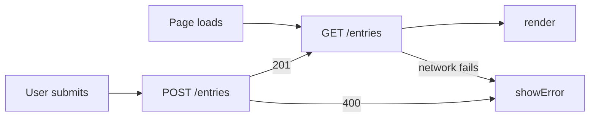

# Meeting Notes: Edit a Note

> Replace this title and every *italic prompt* with your own words. Six
> sections, in this order: What, See It Work, How to Run, Status, Links,
> AI Use. GitHub renders this page; it can show, not only tell.

## What

HW4 repository: TODO add link

A meeting-notes page where entries used to disappear with the browser cache. The user is someone who keeps short notes and needs to fix a typo or update one without deleting and retyping it. The new feature is **Edit a note**: an inline Edit button on each note that saves the change to the Worker. See [PROJECT.md](context/PROJECT.md) and [FEATURES.md](context/FEATURES.md). Entries live in Cloudflare D1 behind a Worker so they survive a cleared cache and show up on any device (ADR-002).

## See It Work

*A GIF or screenshot in `/docs` showing an entry surviving a cleared cache
or appearing in a second browser. Evidence and storefront at once.*

## How to Run

Deployed: *`https://mgt3745-hw4.nuhamin2234.workers.dev/entries`*

From a fresh Codespace:

1. Open the repository in a Codespace. The devcontainer installs xdg-utils and runs `npm install`.
2. `npx wrangler login --device`, then follow [docs/SESSION_B_COMMANDS.md](docs/SESSION_B_COMMANDS.md)
   to create the database, run the schema, and deploy.
3. Paste the deployed URL into `app.js` as `API`.
4. Right-click `index.html`, choose **Open with Live Server**.

Run the code eval: `API=https://mgt3745-hw4.nuhamin2234.workers.dev npm test`

To run the Worker locally instead: `npm run dev` (port 8787, local D1 emulator).

## Status

| Feature | EARS statement | Verdict |
| --- | --- | --- |
| Save an edit | E1: WHEN the user saves an edited note, THE SYSTEM SHALL update the stored text | PASS (automated test, local Worker only; rerun on deployed URL) |
| Reject empty edit | E2: IF the edited text is empty, THEN THE SYSTEM SHALL reject it with a reason and keep the old text | PASS (same caveat) |
| Missing note | E3: IF the note does not exist, THEN THE SYSTEM SHALL respond 404 with a reason | PASS (same caveat) |
| Server unreachable | E4: IF the server cannot be reached while saving an edit, THEN THE SYSTEM SHALL show an error and keep the original text | CANNOT TEST YET (code path written, never exercised in a browser) |
| Edit visible everywhere | E5: THE SYSTEM SHALL return the edited text from GET /entries on any device | PASS (same caveat) |

Full verification table lives in [FEATURES.md](context/FEATURES.md).

## Delegation

- [DDR-001](docs/DDR-001.md): *feature, tool, net hours*
- [DDR-002](docs/DDR-002.md): *the HW4 Copilot delegation, written up*
- [Comparison note](docs/COMPARISON.md)

## Links

Reading order for a stranger: [PROJECT.md](context/PROJECT.md) →
[USERS.md](context/USERS.md) → [FEATURES.md](context/FEATURES.md) →
[ARCHITECTURE.md](context/ARCHITECTURE.md) → [STANDARDS.md](context/STANDARDS.md) →
[TOOLS.md](context/TOOLS.md) → [STYLE.md](context/STYLE.md) →
[EVALS.md](context/EVALS.md) → [SKILLS.md](context/SKILLS.md) → [CLAUDE.md](context/CLAUDE.md)

## AI Use

*Every delegation has a DDR under Delegation above. Hours spent on this assignment: 10.*

*Retired text: Three proto-DDR questions. What did the agent write? What did you check,
and how? What could you not fully verify, and what did you do about it?
For the Worker specifically: name the thing you could not fully inspect.
Hours spent: 10.*
